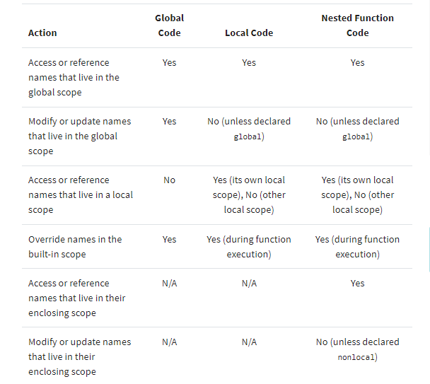

# Python Scope

**Understanding Scope**
* In programming, the scope of a name defines the area of a program in which you can unambiguously access that name, such as variables, functions, objects, and so on. A name will only be visible to and accessible by the code in its scope. Several programming languages take advantage of scope for avoiding name collisions and unpredictable behaviors.


**Most commonly, you’ll distinguish two general scopes:**
1. Global scope: The names that you define in this scope are available to all your code.
2. Local scope: The names that you define in this scope are only available or visible to the code within the scope.


**Names and Scopes in Python**
* Since Python is a dynamically-typed language, variables in Python come into existence when you first assign them a value. On the other hand, functions and classes are available after you define them using def or class, respectively. Finally, modules exist after you import them. As a summary, you can create Python names through one of the following operations:


**Python Scope vs Namespace**
In Python, the concept of scope is closely related to the concept of the namespace. As you’ve learned so far, a Python scope determines where in your program a name is visible. Python scopes are implemented as dictionaries that map names to objects. These dictionaries are commonly called `namespaces`. These are the concrete mechanisms that Python uses to store names. They’re stored in a special attribute called `.__dict__.`


```
>>> import sys
>>> sys.__dict__.keys()
dict_keys(['__name__', '__doc__', '__package__',..., 'argv', 'ps1', 'ps2'])
```
  - After you import sys, you can use .keys() to inspect the keys of sys.__dict__. This returns a list with all the names defined at the top level of the module. In this case, you can say that .__dict__ holds the namespace of sys and is a concrete representation of the module scope.


* The output of some of the examples in this tutorial has been abbreviated (...) to save space. The output may vary based on your platform, Python version, or even on how long you’ve been using your current Python interactive session.


*******

## Using the LEGB Rule for Python Scope

1. Local (or function) scope is the code block or body of any Python function or lambda expression. 
2. Enclosing (or nonlocal) scope is a special scope that only exists for nested functions.
3. Global (or module) scope is the top-most scope in a Python program, script, or module.
4. Built-in scope is a special Python scope that’s created or loaded whenever you run a script or open an interactive session.


***Functions: The Local Scope***

* The local scope or function scope is a Python scope created at function calls. Every time you call a function, you’re also creating a new local scope. On the other hand, you can think of each def statement and lambda expression as a blueprint for new local scopes. These local scopes will come into existence whenever you call the function at hand.


***Nested Functions: The Enclosing Scope***
* Enclosing or nonlocal scope is observed when you nest functions inside other functions. The enclosing scope was added in Python 2.2. It takes the form of the local scope of any enclosing function’s local scopes. Names that you define in the enclosing Python scope are commonly known as nonlocal names. 

***Modules: The Global Scope***
From the moment you start a Python program, you’re in the global Python scope. Internally, Python turns your program’s main script into a module called` __main__ `to hold the main program’s execution. The namespace of this module is the main global scope of your program.




