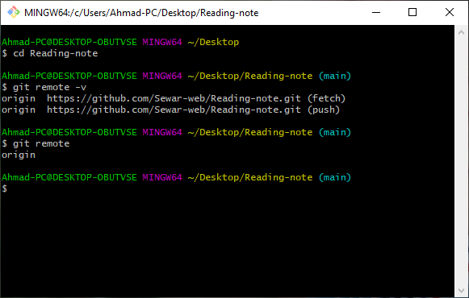

# Remote

**When I type git remote, it displays short names of all specified remote handles**
 
 **and when i use git remote -v, you can view all the remote URLs next to their corresponding short names.**

*  git stash apply
   -It works on importing invisible changes

* Remote Repositories :
  - You can work with multiple repositories, for which you can have read/write or read-only privileges

* 
 